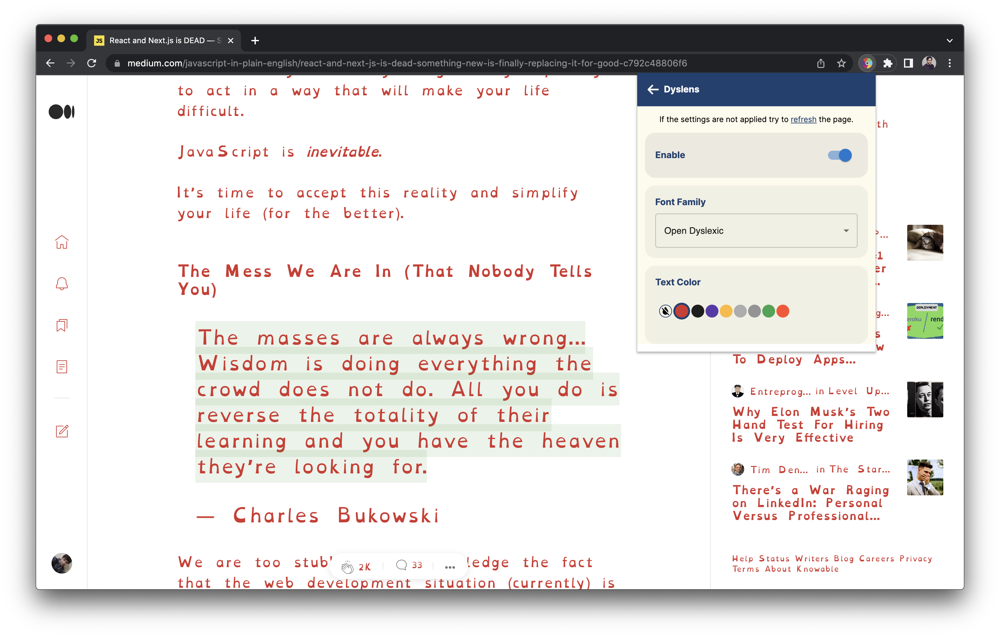

# Dyslens
Dyslens is a open source chrome extension, built and designed to make web more accessible for people who have different reading needs and suffering with dyslexia.

## Features

### Text Settings
Reader can change the text settings of the screen.

### Overlay Settings
Reader can put an overlay and dim the brightness.

### Line Focus Settings
Reader can put an overlay and dim the brightness.

## Technical Details
You can find brief technical details in this document
[TechStuff](./docs/TechStuff.md)
