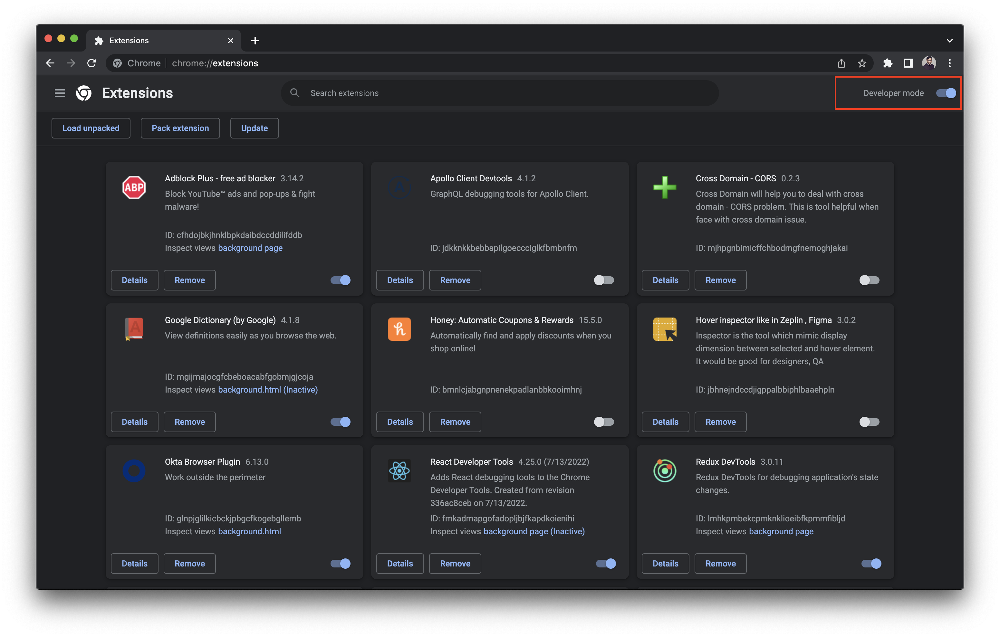
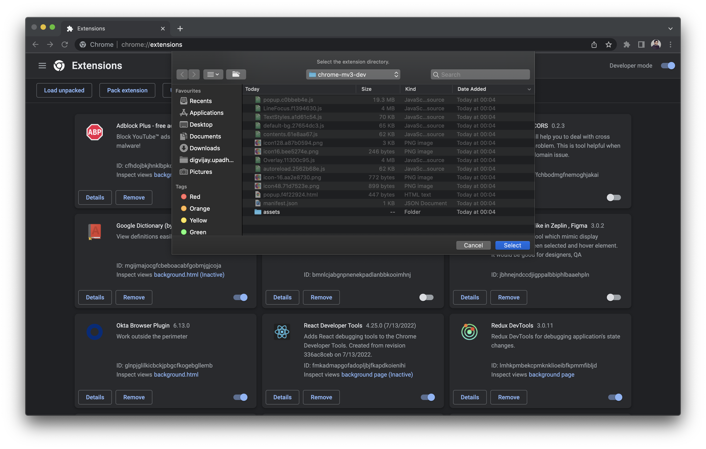
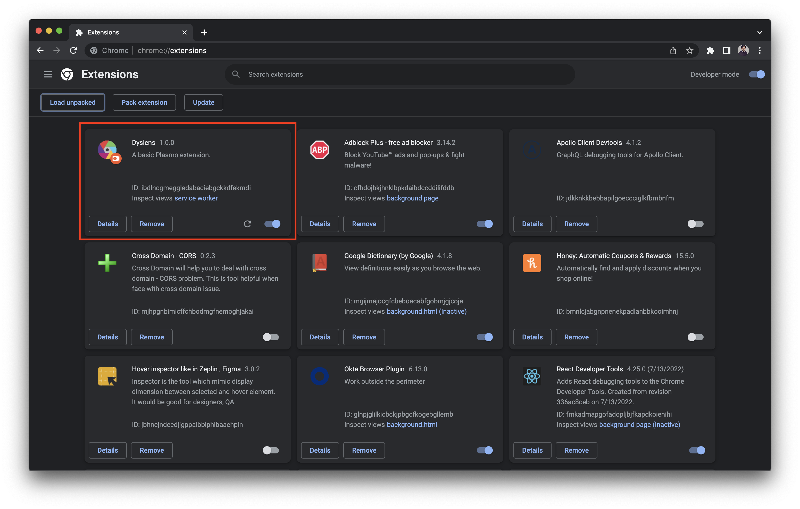

# Tech
This extension was built using [Plasmo extension](https://docs.plasmo.com/) which uses React and Typescript.


## Running Locally
Install all the dependencies and run dev script
```
npm install

npm run dev
```

This should run and build the plugin files in `build/chrome-mv3-dev`.


Open [Chrome extensions](chrome://extensions/) in the browser and enable `Developer mode`



click on `Load unpacked` button which should open the finder dialog



select the `build/chrome-mv3-dev` of the project, you should see Dyslens installed in the extensions.

